# Mongodb 資料庫

* 前言:

    選擇資料庫當作期中作業是因為專題正好是負責管理資料庫，以及看到老師期中作業制定題目的最後一項有資料庫這個選項。不如把在專題時學習資料庫所寫的程式以及資料庫的
    
    基本語法做一個彙整筆記，這個筆記內含基本的資料庫語法 CRUD --> (Create Retrieve Update Delete) ， 以及結合資料庫的一些應用。

    原創性說明 : 100% 原創

## 資料庫環境介紹
--------------------------------------
<pre>
    我所使用的資料庫為 Mongodb Atlas它與傳統所使用的資料庫差別在於，Mongodb 是 NoSQL 的資料庫。（NoSQL）的意思是「Not Only SQL」，指的是不限定為關聯式資料庫
    
    的資料庫管理系統，以混用關聯式資料庫和非關聯式資料庫來達到最佳的儲存效果。
    
    由於非關聯式資料庫不需事先定義資料的Schema及資料之間的關聯，對於資料格式不確定，希望保留未來可以彈性調整的空間，且資料之間沒有複雜的關聯，較著重在快速讀取資
    
    料與可用性。 
    
    Mongodb Atlas 有提供免費的雲端空間 512MB 給予使用若是所使用的容量超過了可以藉由購買 Disk size 的方式擴充資料庫的空間。  
</pre>

## mongodb 環境設定
---------------------------------------
<pre>
* 安裝pymongo

    $ pip install pymongo
</pre>

* 選擇使用的程式語言產生 connection string 貼到所要使用的應用程式裡

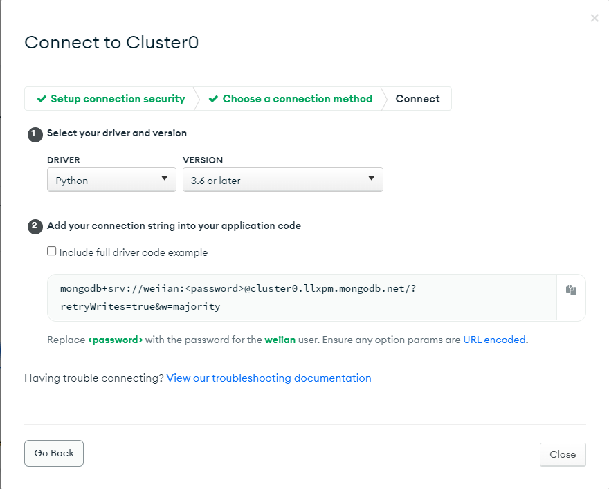

<a src ="connect.py">connect.py</a>為放connection string的檔案，這邊使用 Class 的方式讓 connection string 可以當作物件引用到其他需要連接到資料庫的檔案裡

接著回到 Mongodb  的 network access 加上自己電腦的 ip address 才能讓資料順利的傳入 Mongodb (如下圖)

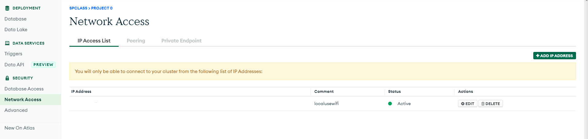 因為安全性問題我把自身的 ip address 遮起來了

## CURD 語法實作 

<pre>
首先介紹 Create 對應的程式為 <a href="https://github.com/weiian000/sp110b/blob/master/midterm/db/insert.py">insert.py</a> 
 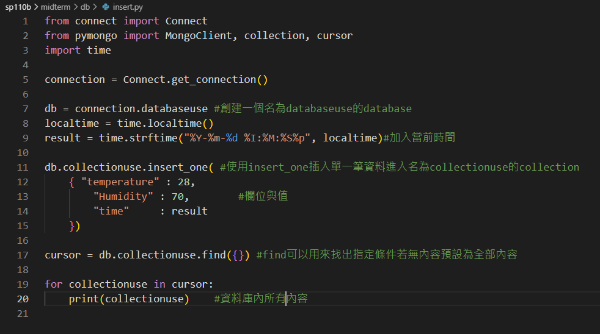

執行結果:
 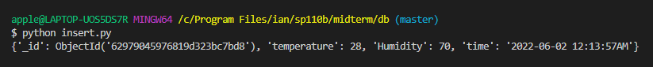

<a href="https://github.com/weiian000/sp110b/blob/master/midterm/db/insert_many.py">insert_many.py</a> 可以一次插入多筆資料

 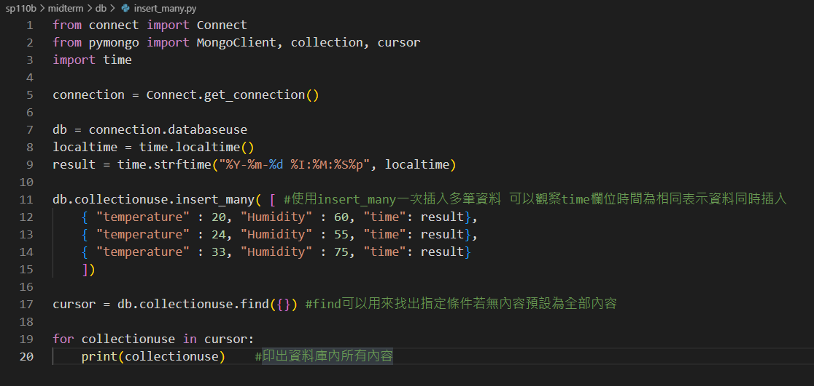

 執行結果:

  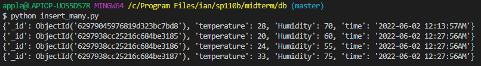

</pre>

-------------------------------------------------

<pre>
接著介紹 Retrieve 對應的程式為 <a href="https://github.com/weiian000/sp110b/blob/master/midterm/db/ReadData.py">ReadData.py</a> 

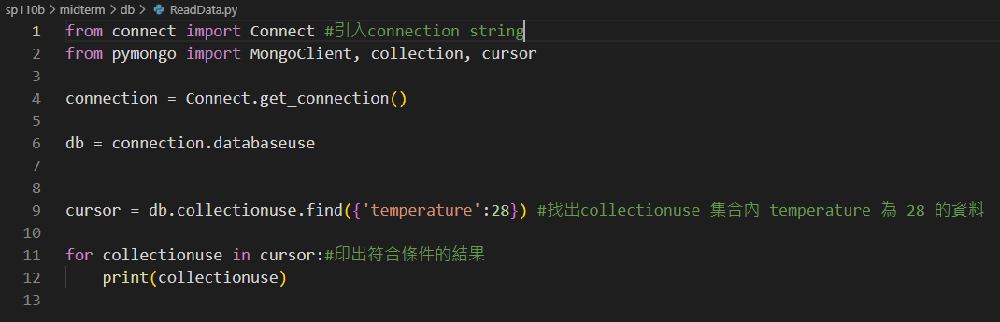

執行結果:

  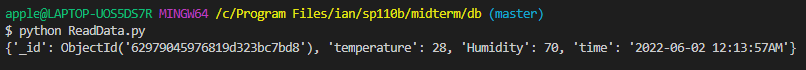
</pre>

-----------------------------------------------------

<pre>
接著介紹 Update 對應的程式為 <a href="https://github.com/weiian000/sp110b/blob/master/midterm/db/update.py">update.py</a> 

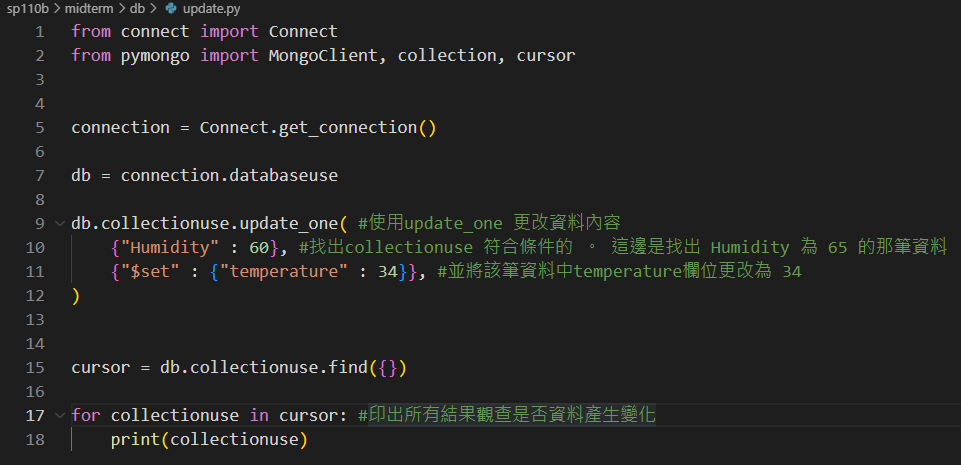

執行結果:
   (更新資料前) 
  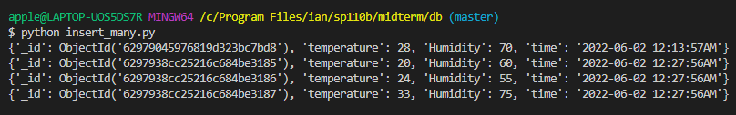
   (更新資料後)
   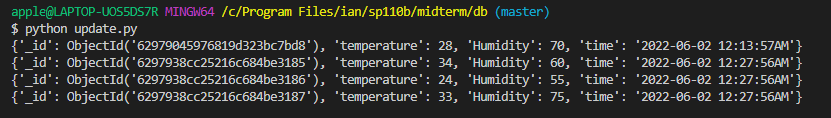
   
   可以看到更新後的第二筆資料 temperature 更新為34

 <a href="https://github.com/weiian000/sp110b/blob/master/midterm/db/update_many.py">update_many.py</a>可以一次更新多筆符合條件的資料 

    
    在執行前再做一次insert.py 新增第五筆資料

執行結果:
   (更新資料前) 
  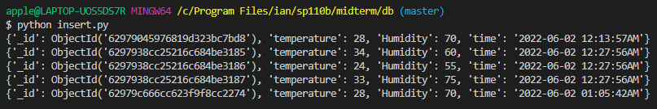
   (更新資料後)
   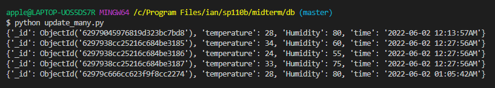
   
   可以看到更新後的 第一筆跟第五筆資料 Humidity 值更新為 80 
</pre>

--------------------------------------------------------
<pre>
接著介紹 Delete 對應的程式為 <a href="https://github.com/weiian000/sp110b/blob/master/midterm/db/delete.py">delete.py</a> 

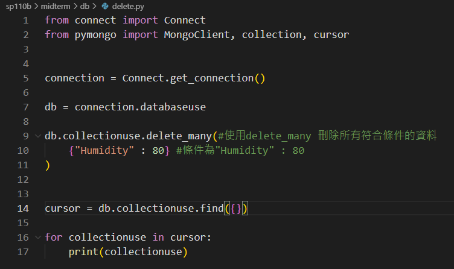

執行結果:

  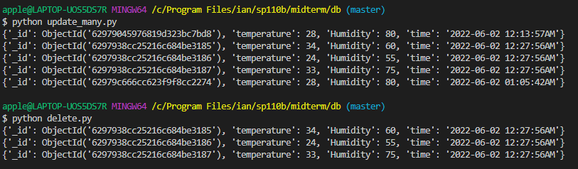

  執行結束後可以看到符合條件的兩筆資料被刪除了
</pre>

----------------------------------------------------------
## Gridfs

對應的程式 <a href="https://github.com/weiian000/sp110b/blob/master/midterm/db/insert_image.py">insert_image.py</a> 
如果今天要把照片上傳到資料庫可以透過 mongodb 套件 Gridfs 完成

GridFS使用兩個集合fs.files和fs.chunks來存儲文件的元數據和塊。 

每個塊由其唯一的ObjectId字段_id標識。 fs.files作爲父文檔進行切換。 

fs.chunks文檔中的files_id字段將該塊鏈接到其父塊。

搭配以下兩張圖片可能更可以理解一些。

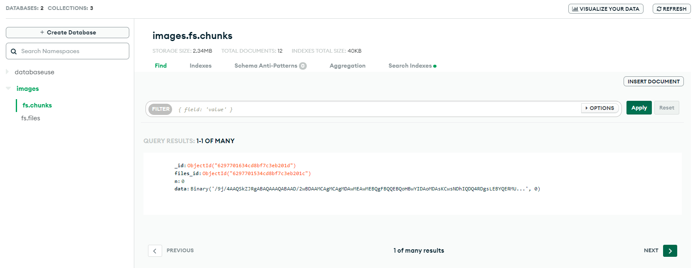

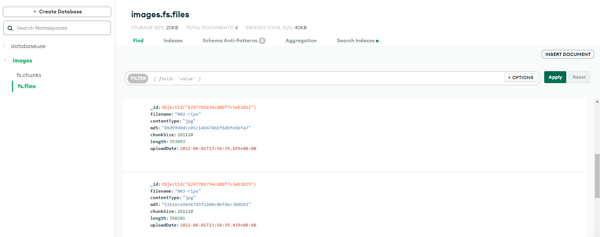

Code

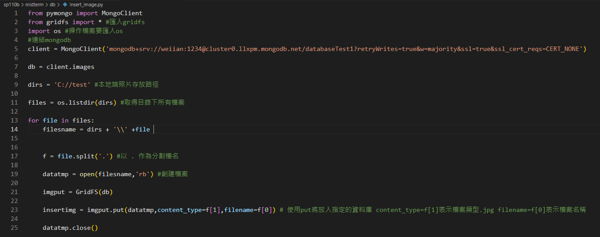

執行結果:

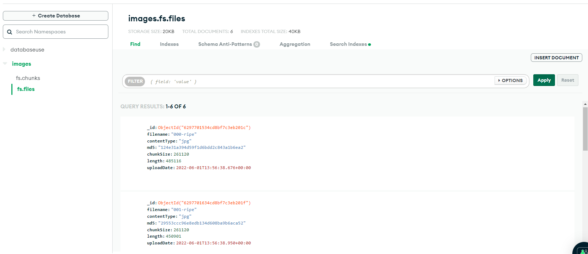

可以看到六張照片放入資料庫

若今天想要從資料庫裡下載照片

對應的程式為 <a href="https://github.com/weiian000/sp110b/blob/master/midterm/db/download_img.py">download_image.py</a> 

Code

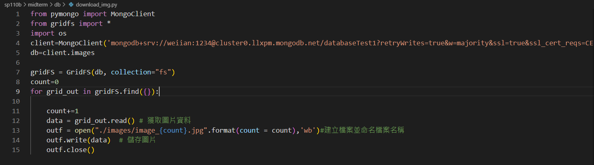

執行結果:

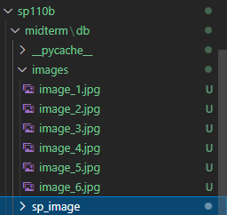

成功的將資料庫的照片下載下來

## 資料庫讀取將資料以圖表呈現

<a href="https://github.com/weiian000/sp110b/blob/master/midterm/db/draw.py">draw.py<a>

執行結果:

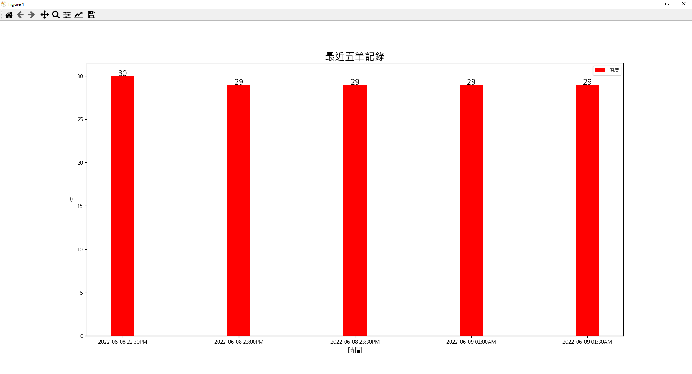
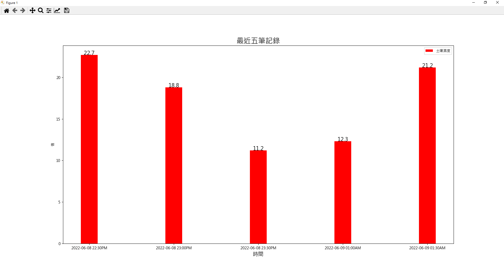

-------------------------------------------------------

除了網頁版的 MongoDB Altas 也可以使用 MongoDB Compass 

下載應用程式並將先前提到的 connection string 放入即可連接

使用下來的感覺會比在網頁上操作來的順暢的多

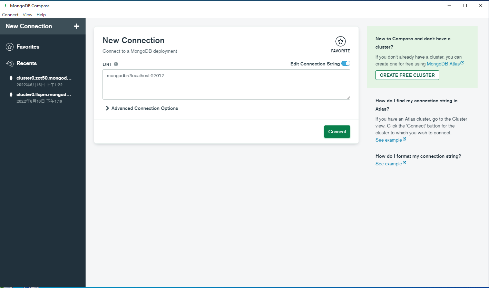

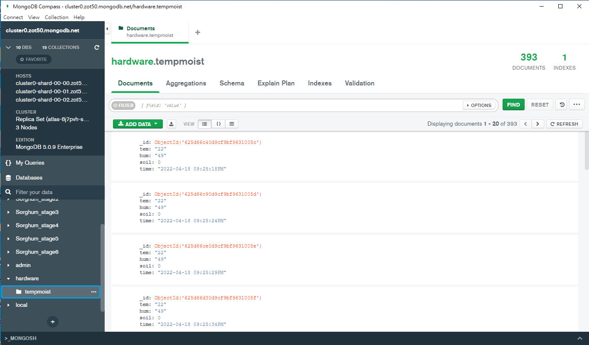
